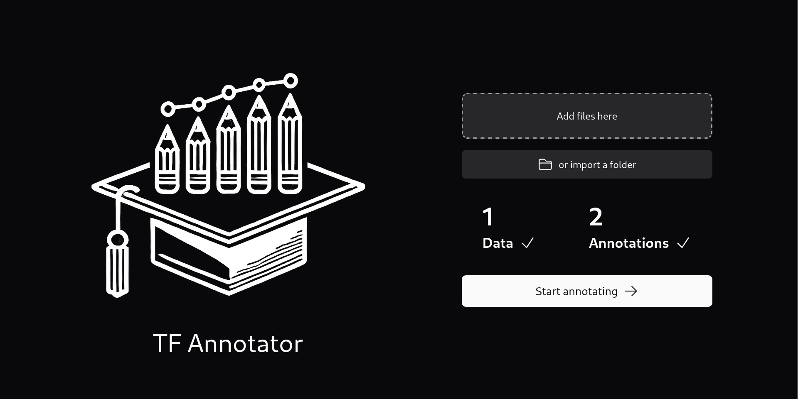
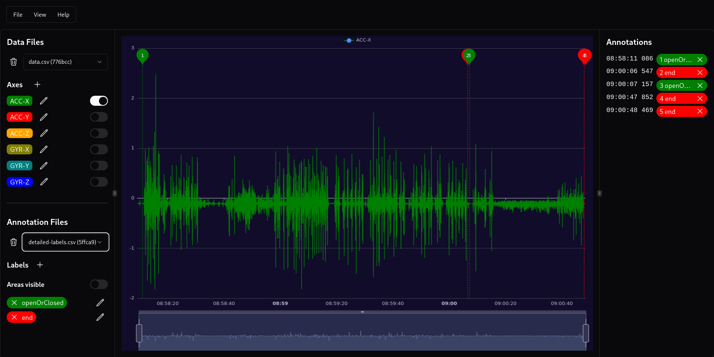

[](https://github.com/larsmathuseck/Timeseries-Annotation/actions/workflows/ci.yml)



# Time Series Annotation Tool

This tool was developed by the Chair of Communication Technology ([ComTec](https://www.comtec.eecs.uni-kassel.de/)) at the University of Kassel. The initial version was created by Lars Mathuseck during his work as a PhD student to manually annotate time series data.

Building on his code and concept, several students contributed improvements over time. The current release, developed by Jonas Thelemann, represents the latest version.

There is a hosted version available [here](https://annotation.comtec.eecs.uni-kassel.de/).

## Data format
The input data must follow the following format.

#### Labels / Annotations

```
Timestamp,Label
2019-07-02 11:33:29.318,LabelA
2019-07-02 11:33:34.749,LabelB
2019-07-02 11:33:36.143,LabelC
2019-07-02 11:33:38.426,LabelA
```

#### Data

```
Timestamp,ACC-X,ACC-Y,ACC-Z,GYR-X,GYR-Y,GYR-Z
2019-07-02 11:33:15.982,-0.0574646,9.811432,-0.01914978,0.0006408691400000001,-0.0007019042999999999,-0.00030517577999999995
2019-07-02 11:33:15.984,-0.0574646,9.801865,-0.03831482,0.0006408691400000001,-0.0007019042999999999,-0.00030517577999999995
2019-07-02 11:33:15.985,-0.0574646,9.801865,-0.03831482,-0.00041198730000000005,0.0014190674,0.0018310547
2019-07-02 11:33:15.990,-0.04309082,9.821014,-0.05267334,-0.00041198730000000005,-0.0007019042999999999,0.0007629394500000001
2019-07-02 11:33:15.996,-0.03831482,9.821014,-0.03831482,-0.00041198730000000005,-0.0007019042999999999,0.0007629394500000001
2019-07-02 11:33:15.997,-0.03831482,9.821014,-0.03831482,-0.00041198730000000005,0.00035095214999999997,-0.00030517577999999995
2019-07-02 11:33:16.000,-0.04309082,9.816222999999999,-0.07661438,0.0006408691400000001,-0.0007019042999999999,0.0007629394500000001
2019-07-02 11:33:16.008,-0.0574646,9.811432,-0.07182312,0.0006408691400000001,-0.0007019042999999999,0.0007629394500000001
```


## Development
This project builds upon the [Nuxt.js](https://nuxtjs.org/) framework.

Install [Node.js](https://nodejs.org/) and [pnpm](https://pnpm.io/).
Then run `pnpm i` to install the project's dependencies.
After that, use `pnpm dev` for development or `pnpm build` to generate the [static page](https://nuxtjs.org/blog/going-full-static).

Alternatively, build the provided [Dockerfile](https://www.docker.com/) using `docker build -t larsmathuseck/Timeseries-Annotation .` and run the resulting image using `docker run larsmathuseck/Timeseries-Annotation`.

## Screenshot


## Contribution
Feel free to contribute to this project by opening a pull request.

## License

This project is licensed under the [MIT License](LICENSE).

